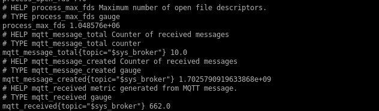

# test ansible playbook with custom roles
- firewall
- certbot
- mosquitto
## Description
It deploys mosquitto, gets letsencrypt certificates, adds mosquitto user with password, starts mosquitto exporter.
To pass certificate challenge please check that host has port 80 available from public networks.

## How to use
export variables mentioned in go.sh or create your own file with variables
